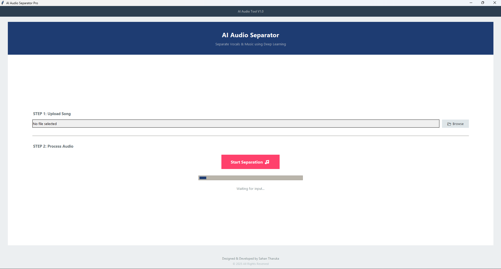

# AI Audio Separator Pro 🎵

A professional desktop application developed to separate vocals and music from audio tracks using advanced AI technology (Demucs). Designed with a modern, user-friendly interface using Python.

**Developed by: Sahan Tharuka**

---

## 🚀 Features
- **AI-Powered Separation:** Splits songs into Vocals and Instrumentals using Demucs AI.
- **Modern UI:** Clean, professional interface built with Python Tkinter.
- **Local Processing:** Runs 100% offline on your computer.
- **Format Support:** Supports MP3 and WAV files.

## 📸 Screenshots

## 🛠️ Installation Guide

Follow these steps to set up the project on your computer:

### Step 1: Install Python
Ensure you have Python installed on your system. You can download it from python.org.

### Step 2: Download the Project
Clone this repository or download the ZIP file:

    git clone https://github.com/SahanST19/ai-audio-separator.git

### Step 3: Install Requirements
Open your terminal or command prompt inside the project folder and run:

    pip install -r requirements.txt

### Step 4: Setup FFmpeg (⚠️ IMPORTANT)
This application requires **FFmpeg** to process audio files. Since FFmpeg files are large, they are not included in this repository. You must add them manually:

1. Download the FFmpeg build from [gyan.dev](https://www.gyan.dev/ffmpeg/builds/).
2. Extract the downloaded ZIP file.
3. Inside this project folder, create a new folder named **`bin`**.
4. Copy these three files and all files into the `bin` folder:
   - `ffmpeg.exe`
   - `ffplay.exe`
   - `ffprobe.exe`

> **Note:** The app will automatically detect FFmpeg inside the `bin` folder.

---

## ▶️ How to Run
1. Open the project folder in your terminal.
2. Run the application:

    python app.py

3. Click "Browse" to select a song and hit "Start Separation".

---

## 📂 Output Location
Once processing is complete, find your separated files here:

    project_folder/separated/htdemucs/song_name/

---

## 👨‍💻 Author
**Sahan Tharuka**
- GitHub: [SahanST19](https://github.com/SahanST19)

---

© 2025 Sahan Tharuka. All Rights Reserved.

